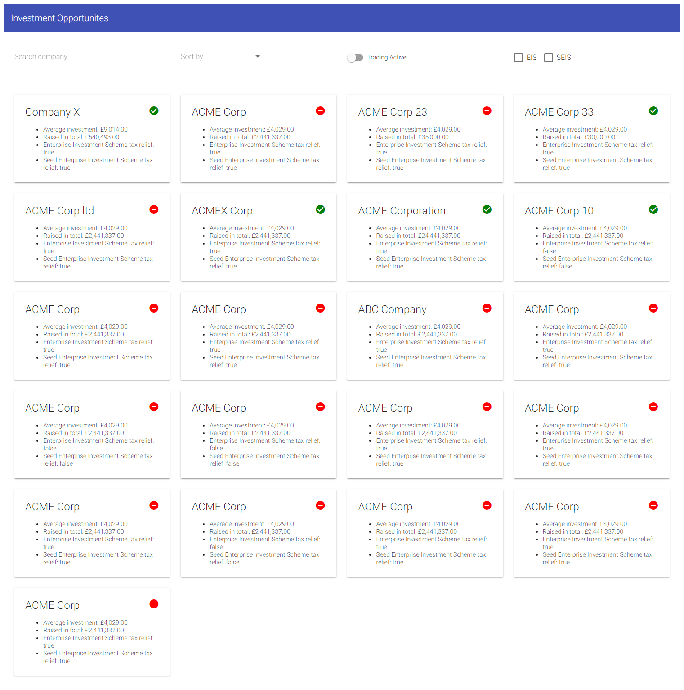

# Front-end Challenge
***

This project is a front-end challenge and requires:

1. Angular CLI: 6.0.3
2. Node: 8.11.2
3. Angular: 6.0.2

## Docker
***

Create the Docker image and run it locally

`docker build --rm -f Dockerfile -t sr-app1:latest .`

`docker run -it -v ${PWD}:/usr/src/app -v /usr/src/app/node_modules -p 4200:4200 --rm sr-app1`

## Requirements
***
1. Install Node (v8.11.2)

2. Install the Angular CLI

`npm install -g @angular/cli`

## Getting Started
1. Clone this repository

`git clone https://github.com/kpchiragowni/sr.git`
`cd sr`

2. Install the npm packages

npm i

## Development server
***

Run `ng serve` for a dev server. Navigate to `http://localhost:4200/`. The app will automatically reload if you change any of the source files.

## Build
***

Run `ng build` to build the project. The build artifacts will be stored in the `dist/` directory. Use the `--prod` flag for a production build.

## Running unit tests

Run `ng test` to execute the unit tests via [Karma](https://karma-runner.github.io).

## Running end-to-end tests

Run `ng e2e` to execute the end-to-end tests via [Protractor](http://www.protractortest.org/).
